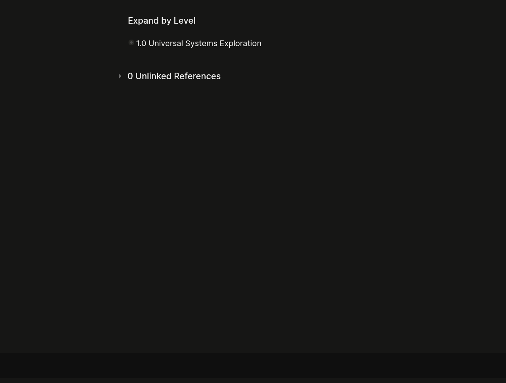

# Expand by Level LogSeq plugin

**Collapse and expand every block on the current page to a chosen depth — instantly, with a single keystroke.**

Press `Alt+1` to collapse everything. `Alt+2` to see only the top level. `Alt+5` to drill down five levels. One keystroke, the whole outline reshapes around you. Perfect for navigating long pages, reviewing journals, or focusing on the structure of a document.



> [!NOTE]
> **[Logseq](https://logseq.com)** is a privacy-first, open-source knowledge management platform. This plugin extends its outliner functionality with keyboard-driven block visibility by nesting depth. — [Project repository](https://github.com/darkone-linux/logseq-expand-by-level)

## Shortcuts

| Shortcut  | Effect                                  |
| --------- | --------------------------------------- |
| `Alt+1`   | Collapse all blocks                     |
| `Alt+2`   | Show root blocks only                   |
| `Alt+3`   | Expand to depth 2, collapse deeper      |
| `Alt+4`   | Expand to depth 3, collapse deeper      |
| `Alt+5`   | Expand to depth 4, collapse deeper      |
| `Alt+6`   | Expand to depth 5, collapse deeper      |
| `Alt+7`   | Expand to depth 6, collapse deeper      |
| `Alt+8`   | Expand to depth 7, collapse deeper      |

Both the top-row digits and the **numpad** work. Shortcuts also fire when **zoomed into a block** — the level then applies to that subtree.

## Tips

- **Stick to `Alt`** as your modifier. It's ergonomic (single-hand), reliable across the app, and plays well with both the digit row and the numpad. `Alt+Shift` looks tempting but is unstable on the numpad and inside zoomed blocks in some Logseq builds.
- **Journals home page works differently.** That page lazy-loads journals as you scroll, so the plugin only acts on what's currently rendered in the DOM at the moment you press the shortcut. For deterministic behavior, open the day's journal page directly (click its title) — there the shortcut applies to the whole page.
- **Any page, any zoom level.** Regular pages, zoomed blocks, and the sidebar all respond to the shortcut.

## Configuration

Open **Settings → Plugins → Expand by Level** and edit the `modifier` field.

| Value         | Combination                                  |
| ------------- | -------------------------------------------- |
| `alt`         | Alt — recommended                            |
| `ctrl+alt`    | Ctrl+Alt                                     |
| `ctrl+shift`  | Ctrl+Shift                                   |
| `mod+shift`   | Cmd+Shift on macOS, Ctrl+Shift elsewhere     |

After changing the modifier, **disable then re-enable** the plugin for the new bindings to take effect.

Need to override a single binding? **Settings → Keyboard Shortcuts → search "Expand by Level"**.

## Installation

### Marketplace

Search **"Expand by Level"** in **Settings → Plugins → Marketplace**.

### Manual / development

```bash
git clone https://github.com/darkone-linux/logseq-expand-by-level.git
cd logseq-expand-by-level
npm install
npm run build
```

Then **Settings → Plugins → Load unpacked plugin** → select the project root.

## Development

```bash
npm run dev       # Vite dev server with HMR
npm run build     # production build → dist/
```

## Publishing

1. `just bump [patch|minor|major]` — bumps version, commits, tags
2. `git push && git push --tags`
3. Create a GitHub Release from the tag
4. The [publish workflow](./.github/workflows/publish.yml) attaches the zip
5. Submit a PR to [logseq/marketplace](https://github.com/logseq/marketplace)
